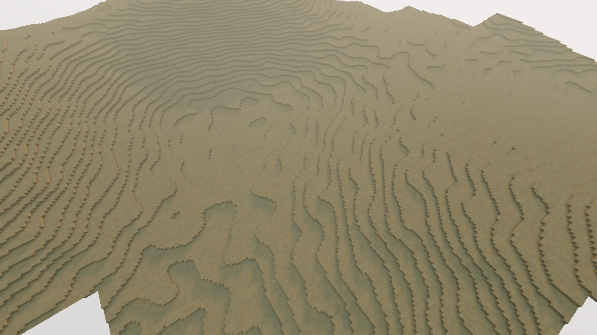
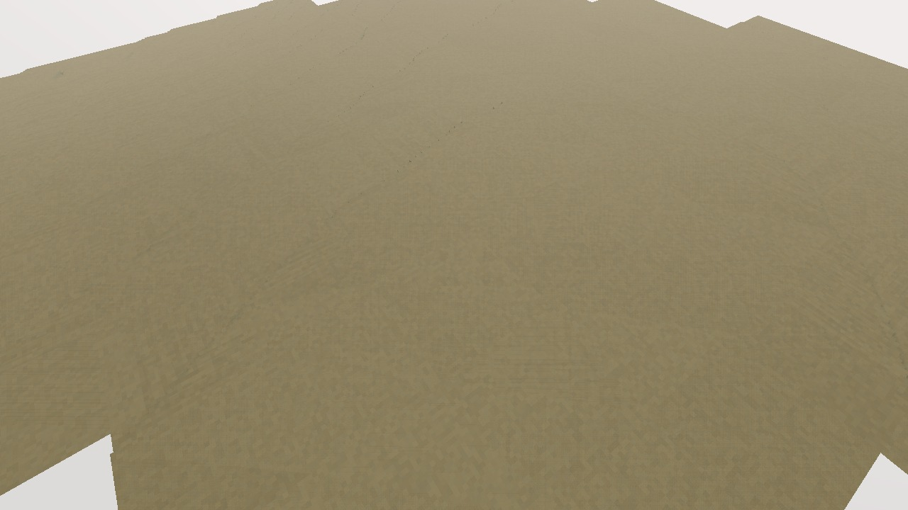
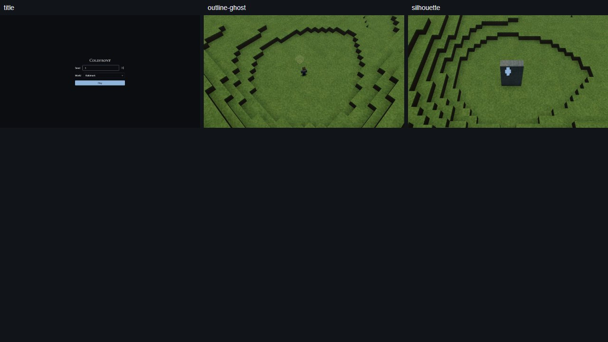

# Calmer ordinary ground

The owner's 9 October correction is implemented: ordinary hills extend over
larger distances and strong small-scale detail occupies coherent patches.
The change is integrated for generation 3; publication checks are in progress.
The independent Astra reviewer accepted the bounded change after opening all
twelve matched diagnostic images.

## What changed

- Ordinary meso wavelengths are now 300–600 m; micro wavelengths are 24–28 m.
- A continuous, world-anchored 1.6 km field uses the measured noise quantiles
  to distribute calm ground and rough patches. Calm areas retain 25% of their
  hill amplitude and 8% of their small-detail amplitude.
- Macro geography, regional footprints, underground layout and water ownership
  are unchanged. Mountain, lake-bed, Blackwater, Rim and Frost profiles retain
  their original formulas. Border blends remain continuous.
- Heights remain continuous before voxel sampling; no artificial height bands
  were introduced to make flat ground.

## Matched evidence

The probe compares 52 fixed 128 m patches near thirteen seed-1 postcard anchors,
with four patches per anchor and 16,641 one-metre sample positions per patch.
“Steps” means neighbouring voxel-centre columns with different top voxel
heights. “Gentle” means a gradient of at most 1:10. These are local patch
measurements, not whole-world coverage or connected settlement-area measures.
Some offset patches cross region borders.

| Region group | Fewer one-metre steps | Gentle samples before | Gentle samples after |
|---|---:|---:|---:|
| Plains | 39% | 60% | 80% |
| Desert | 74% | 23% | 94% |
| Jungle | 68% | 17% | 77% |
| Swamp | 61% | 86% | 99.8% |

All six image pairs use the same seed, camera position, target, lens, time,
radius and renderer. Both coordinator and independent reviewer opened the
plains, desert, jungle, swamp, mountain and Rim pairs. Desert, jungle and swamp
show broad quieter ground; plains retain a larger sloping hill with fewer
small contour loops. The mountain and Rim image pairs are byte-identical.

Desert before:

Desert after:

These are diagnostic aerials, not graded postcards or actual Overhead play.
The finite loaded patch and existing haze remain visible. They establish the
local change without proving a distant horizon or final desert feature mix.

## Validation and limits

The isolated candidate passed 67 focused/forbidden-token tests, eighteen full
world invariants over seeds 1–3, TypeScript and scoped formatting checks.
All 150 original test-world chunk baselines are unchanged. A fresh seed-1
WorldPlan has a byte-identical macro height array and retains 30 Seats,
106 forts, 46 descents and 256 spawn candidates. Main-world golden records
are regenerated with the coordinated generation-3 change.

Integrated verification now passes 337 tests across 54 files, TypeScript/lint,
complete UI lint, production build, the local browser smoke/drive and all
nineteen world-travel cases. All sixteen regional postcards, TEST-1, atlas and
slice were regenerated and reviewed. The independent reviewer opened 37 current
images and verified their source and image hashes. The five protected regional
postcards and TEST-1 are byte-identical to their previous accepted captures;
TEST-1 remains 15/20. Regional postcards remain ungraded first-pass evidence.
Clean Node 22 build, the fresh kernel benchmark and publication are still pending.

Two failed checks were retained and resolved without weakening assertions. The
gallery's negative text probe was below the viewport when an image-only fixture
was selected first; adding the title fixture first made all seven probes run
visibly and pass. The first full test run found a hardcoded generation-2
assertion; it now expects the intentional generation-3 value, and all 337 tests
pass. No generated test-world records changed.

## Interface regression review

The coordinator and independent reviewer opened `out/ui/title-1280.png`,
`title-1920.png`, `title-150.png`, and the same three profile files for
`outline-ghost` and `silhouette`. Words read on the title: **Coldfront**, **Seed**,
**1**, **World**, **Kaldmark**, **Play**. The HUD fixtures contain no words.
The 1920 HUD gallery centres the existing 1280×720 engine evidence image; it
does not claim another live 1920 world render.

| A7 check | Title | Outline/ghost and silhouette |
|---|---|---|
| 1. Exact rows and words, no additions | Pass | Pass for selected canvas rows |
| 2. No clipping, accidental wrap or overlap | Pass at all three profiles | Pass; marks visible, no text |
| 3. Alignment and spacing | Pass | Pass for image fixtures |
| 4. Prescribed components and disabled reasons | Pass; no disabled control | Not applicable to canvas evidence |
| 5. Required layout and order | Pass | Pass |
| 6. Blocking-screen keys | Pass: Seed → Random seed → World → Play; no title exit requirement | Not applicable to nonblocking canvas |

[Interface gallery](https://dex.place/coldfront/?gallery).
This is selected-fixture regression coverage; unchanged screens retain their
previous acceptance.

Distant terrain was already required by terrain specification §13.5 and
roadmap phase 1.4: LOD0–6, full-height column tiles, up to about 16 km reach at
altitude, and at least 5 km of real terrain in the acceptance views. It remains
unimplemented. The calmer-ground change does not close that requirement.
