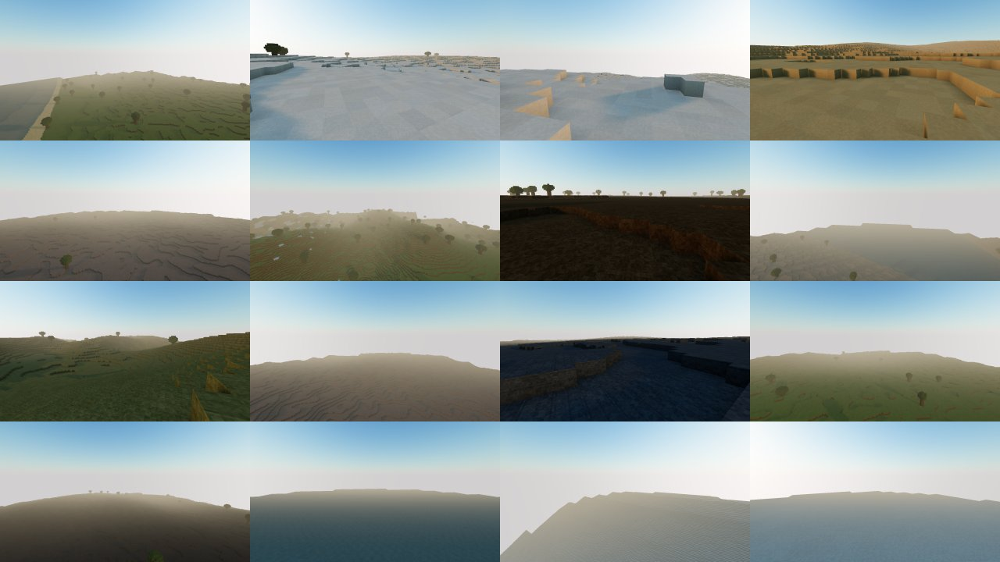

# Phase 1.2 — First-pass regional postcards

All sixteen named surface regions have a real production capture. These are **ungraded first passes** showing current geography and palette; detailed terrain features and far LOD retain their later phases.

The sheet reads left to right, top to bottom: plains, tundra, mountains, desert; boneyard, jungle, swamp, lake; twilight, hellscape, shardfields, isles; nadir, blackwater, rim, frost. Individual 1280 × 720 JPEGs are `docs/postcards/m1/P12-<id>-s1.jpg`.

## What the opened images show

| Regions | Current appearance and limits |
|---|---|
| Plains, jungle, isles | Green stepped terrain and placeholder trees; jungle has steeper relief and exposed pale rock. Giant trees, karst and floating islands are not present yet. |
| Tundra, mountains, rim, frost | Snow/ice palettes, stepped uplands and the steep outer wall. The Frost is a broad pale landscape; detailed mountain erosion and ice formations come later. |
| Desert, boneyard, hellscape | Ochre or grey bare terrain. Bones, calderas, lava and the independently authored thorn studies are not placed in this build. |
| Swamp, twilight, shardfields, nadir | Dark soil/rock or green-brown relief. Landmark vegetation, monoliths, crystals and Keep massing remain later work. |
| Lake, blackwater | Owned water and shore/basin forms. The corrected deep-water surface is blue and continuous; the previous white plane and internal grid are removed. The finite loaded boundary remains visible at distance. |

The coordinator and independent Astra reviewer each opened all twenty final images: sixteen regional postcards, TEST-1, the global sheet and two refreshed HUD captures. Final canonical image/source hashes match. Blackwater and Lake no longer show the water grid/white-plane defect; no new consequential issue was found. The regional set passes its ungraded phase 1.2 review. Fresh TEST-1 score is **15/20**, above its 12-point bar; this replaces the historical 16-point score for the earlier capture. HUD outline, ghost and silhouette marks pass.

## Capture and verification

- One persistent page and world plan capture all sixteen regions; the plan is reused in fifteen shots. The final camera's requested chunks must be generated, lit, meshed and uploaded before rendering.
- Captures use the specified 1280 × 720 frame, DPR 1, 70° postcard lens, frozen time, no avatar/HUD, no continuous render loop and no upload cap. Two renders precede in-page PNG capture; JPEGs use quality 85.
- Saved cameras are tied to seed, world/generation source and resolver provenance. Every requested camera is geometrically revalidated. A candidate-placement change can preserve a still-valid independent camera; stale world-source identities cannot.
- Blackwater's bridge anchor was too close to high ground for the original small search. Its wider deterministic search retains the same clearance, sky, feature and sunlight checks. All thirteen previously resolved cameras were retained with identical geometry results and scores.
- Leaving capture during a teleport glide previously reused an old display-clock timestamp. The new regression reproduced the snap and verifies that the restored destination remains stable.
- Transparent face enlargement caused overlapping water edges. Constant transmission exposed the bright background beneath deep water. The repair limits enlargement to opaque/cutout faces and uses an opaque-scene depth texture for water absorption. Shallow TEST-1 steps remain visible. Depth conversion, framebuffer isolation/restoration, resize, context loss and disposal have focused checks and independent review.

Final main capture: `out/postcards/runs/main-s1-1791511865068/run.json`; TEST-1: `out/postcards/runs/test-s1-1791512023756/run.json`. Both report success, no application errors or external requests, closed browsers and four retained ReadPixels performance warnings. Main capture binds 118 source files. Earlier failures and baseline images are retained in their own attempts.

The final validation pipeline passes **310 tests across 51 files**, TypeScript/Biome, complete UI lint, production build and local browser smoke/drive. The original formatting-only failure in a diagnostic driver is retained separately; the final water run passes without that repair step.

## Timing and scope

Main shot median/p95/max are **8.634 / 14.809 / 21.104 seconds**; requested chunks range from 305 to 1,204. All sixteen plus sheets take 187.622 seconds including cached-camera validation and browser setup. These are SwiftShader observations, not hardware FPS. Camera search is measured separately; the repaired fifty-candidate Blackwater search takes 92.952 seconds.

The three-seed atlas/slice, site census, golden hashes, UI checklist and full terrain-generation benchmark are recorded in [progress](../progress.md) and the existing phase reports. Their generation inputs are unchanged by this rendering/tooling increment. No new UI row or world-generation version is introduced.

Public gameplay automation remains unavailable after automatic approval review rejected the earlier public-browser launch as “blocked by policy.” Local play and public version/assets/header verification remain separate evidence.
